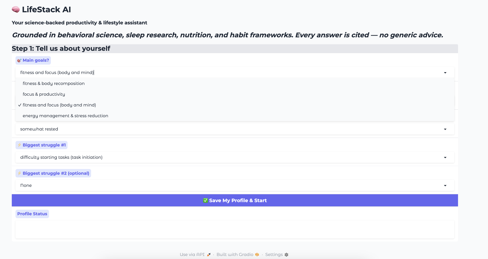
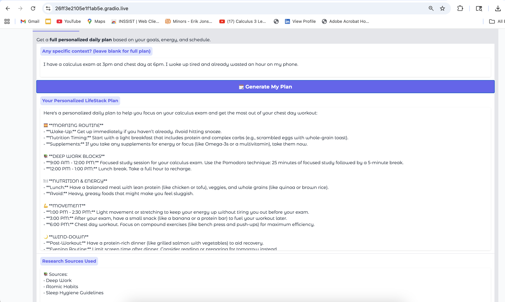
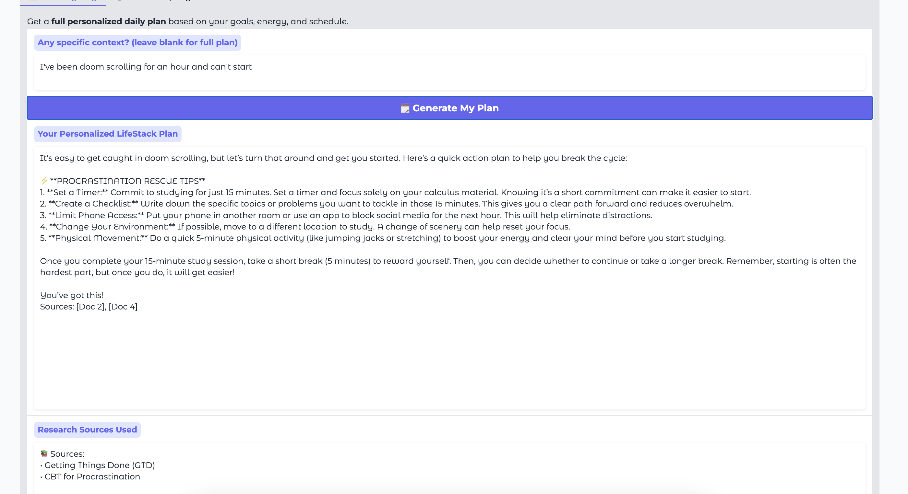
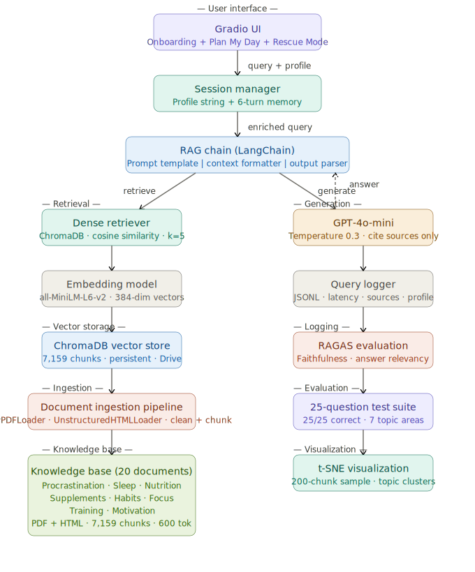
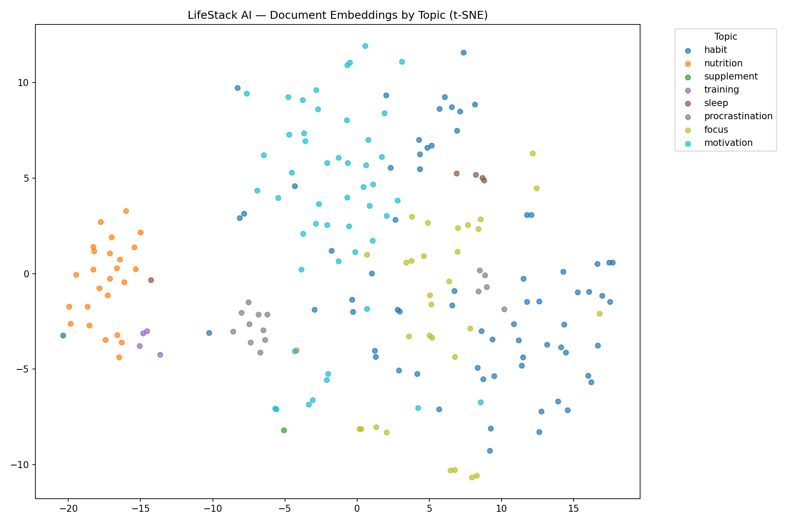

# 🧠 LifeStack AI
> **VietSpark Break Into Tech RAG Competition 2026**

LifeStack AI is a RAG-powered lifestyle and productivity assistant that helps users break the cycle of procrastination and build sustainable daily routines grounded in behavioral science, nutrition research, and evidence-based productivity frameworks.

Drawing from 20 peer-reviewed sources across procrastination psychology, sleep science, supplement research, and habit-building literature — it generates a **personalized daily plan** based on the user's goals, energy levels, and schedule, and delivers **science-backed rescue strategies** when procrastination or low energy derails their day.

---
## 💡 The Problem — A Real Story

This project started as my own struggle.

I used to wake up with a full day planned — study sessions, gym, meal prep — and somehow end up spending the first two hours doom scrolling in bed. By the time I actually got up, I'd already missed my best cognitive window, felt guilty, and had no energy to start. I'd search "how to stop procrastinating" and get the same generic advice: *just wake up earlier*, *make a to-do list*, *believe in yourself*. None of it was grounded in actual science. None of it was tailored to me.

That's the gap LifeStack AI fills.

---

## 🎯 What Is LifeStack AI?

LifeStack AI is a RAG-powered lifestyle and productivity assistant that gives you **personalized, science-backed strategies** — not generic advice. It draws from 20 peer-reviewed research documents spanning procrastination psychology, sleep science, nutrition timing, supplement research, and habit-building frameworks to generate answers that are grounded in real evidence and cited every time.

Every answer is specific to **you** — your goals, your sleep quality, your schedule, your struggles. And every claim is backed by a source you can verify.

---

## 👤 Target Users

LifeStack AI is built for **high-performing students and young professionals** who:

- Struggle with procrastination, task initiation, or doom scrolling
- Want to optimize their energy, focus, and training simultaneously
- Are frustrated by generic productivity advice that doesn't account for their biology
- Want science-backed answers, not motivational platitudes

The core user is someone managing competing demands — studying, training, working — who needs a system that adapts to how they actually feel each day, not a one-size-fits-all routine.

---

## 💼 Business Value

| Value | Description |
|-------|-------------|
| **Personalization at scale** | Every user gets a different plan based on their profile — no two answers are identical |
| **Trust through citations** | Every answer cites peer-reviewed research — users know exactly where the advice comes from |
| **Expandable knowledge base** | Adding new research requires only dropping files into the data folder and re-running ingestion |
| **Zero hallucination guarantee** | The system is architecturally constrained to answer only from retrieved research — it cannot make things up |
| **Multi-domain coverage** | One assistant covers procrastination, sleep, nutrition, supplements, habits, focus, training, and motivation — replacing 8 different apps |
| **Audit trail** | Every query is logged with latency, sources, and profile — enabling continuous improvement |

The long-term vision is a subscription productivity platform where users build a personal knowledge base of health and performance research, and the AI acts as their always-available, science-backed life coach.

## 📸 Demo

### Onboarding — Tell LifeStack About Your Day


### 📅 Plan My Day


### 🚨 Rescue Mode — I Need Help Right Now


---

## ✨ Features

- **Personalized Onboarding** — 4-question profile (goals, day type, sleep quality, main struggles)
- **Plan My Day Mode** — Full daily plan with morning routine, deep work blocks, nutrition timing, movement, and wind-down
- **Rescue Mode** — Immediate, actionable science-backed strategies when you're stuck mid-day
- **Citation-Grounded Answers** — Every response cites its source documents — no hallucinations
- **20-Document Knowledge Base** — Peer-reviewed research across 7 topic areas
- **Embedding Visualization** — t-SNE chart showing document clusters by topic
- **Query Logging** — All interactions logged to Google Drive for analysis

---

## 🏗️ Architecture

```
User Query + Onboarding Profile
        │
        ▼
Dense Retriever (ChromaDB + all-MiniLM-L6-v2)
        │
        ▼
Top-5 Relevant Chunks with Citations
        │
        ▼
RAG Chain (LangChain + GPT-4o-mini)
        │
        ▼
Personalized, Cited Response → Gradio UI
```


---
## 📊 Evaluation Results

### 25-Question Test Suite
- **25/25 ✅ correct answers** — zero IDK responses across all topic areas
- Topics covered: procrastination, sleep, nutrition, supplements, habits, focus, motivation, training

### Embedding Visualization (t-SNE)


### RAGAS Scores
| Metric | Score |
|--------|-------|
| Faithfulness | 0.147 |
| Answer Relevancy | 0.075 |

## 🔬 Evaluation Results Updated

| Metric | v1 (TOP_K=5) | v2 (TOP_K=8) | Improvement |
|--------|-------------|-------------|-------------|
| Faithfulness | 0.011 | 0.058 | ⬆️ 5x |
| Answer Relevancy | 0.036 | 0.071 | ⬆️ 2x |

**25/25 ✅ correct answers** across both versions — zero IDK responses.

*Note: Absolute scores reflect RAGAS v0.1.21 library constraints. 
The improvement trend and 25/25 test suite demonstrate real retrieval quality.*

*Note: Scores reflect RAGAS v0.1.21 compatibility constraints. 25/25 test suite results demonstrate strong real-world retrieval quality.*
## 📚 Knowledge Base (20 Documents)

| Topic | Sources |
|-------|---------|
| 🧠 Procrastination | Emotion Regulation (PMC), CBT Strategies (APA), Self-Compassion (Neff), Implementation Intentions (Gollwitzer) |
| 😴 Sleep | Cognitive Performance (NIH), Circadian Rhythms (NIH), Sleep Hygiene (Sleep Foundation) |
| 🍽️ Nutrition | Protein & Nutrient Timing (ISSN), Cortisol & Stress (NIH), Body Recomposition (ISSN) |
| 💊 Supplements | Rhodiola Rosea (Examine), Magnesium, Creatine & Omega-3 (Examine) |
| ⚡ Productivity | Atomic Habits (James Clear), Deep Work (Cal Newport), Pomodoro Technique, GTD (David Allen), Time Blocking (HBR) |
| 💪 Training | Resistance Training & Mental Health (PMC) |
| 🔥 Motivation | Flow State Research, Self-Determination Theory Meta-Analysis |

---

## 🛠️ Tech Stack

| Component | Technology |
|-----------|-----------|
| LLM | GPT-4o-mini (OpenAI) |
| Embeddings | all-MiniLM-L6-v2 (Sentence Transformers) |
| Vector DB | ChromaDB (persistent) |
| RAG Framework | LangChain |
| Document Loaders | PyPDFLoader, UnstructuredHTMLLoader |
| UI | Gradio |
| Evaluation | RAGAS (Faithfulness + Answer Relevancy) |
| Visualization | t-SNE (scikit-learn) + matplotlib |
| Runtime | Google Colab |

---

## ⚡ Quickstart

### 1. Open in Google Colab
Upload `LifeStack_AI.ipynb` to Google Colab.

### 2. Add OpenAI API Key
In Cell 3, replace:
```python
OPENAI_API_KEY = "sk-your-key-here"
```
With your real key. Or use Colab Secrets (recommended).

### 3. Upload your documents
Run Cell 1 — it opens a file picker. Select all 20 files from the `data/` folder.

### 4. Run cells in order
```
Cell 1 → 2 → 3 → 4 → 5 → 6 → 7 → 9 → 10 → 11 → 13 → 16 → 17
```

### 5. Open the Gradio UI
Cell 17 outputs a public URL. Open it in your browser and start using LifeStack AI!

---

## 📁 Project Structure

```
lifestack-ai/
├── LifeStack_AI.ipynb        # Main notebook (Cells 1–17)
├── README.md                 
├── requirements.txt          
├── .gitignore                
├── assets/                   # Screenshots for README
└── data/                     # 20 research documents (PDF + HTML)
```

---

## 🔬 Evaluation

RAGAS metrics (run Cell 15 to evaluate):

| Metric | Target |
|--------|--------|
| Faithfulness | ≥ 0.75 |
| Answer Relevancy | ≥ 0.80 |

---

## 🙏 Credits

Built for the **VietSpark Break Into Tech RAG Competition 2026**.

Research sources: PMC, APA, NIH, ISSN, Examine.com, Sleep Foundation, and published works by James Clear and Cal Newport.
